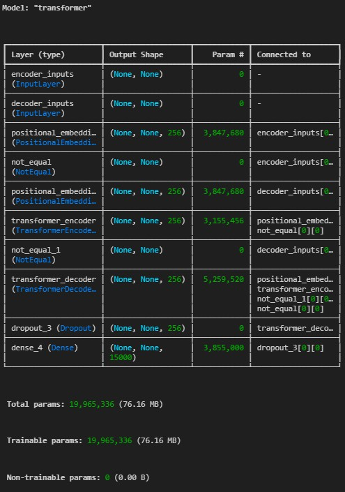
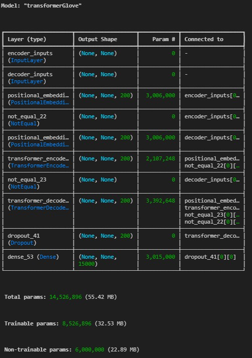

# Transformer Challenge for 3/22/2025

    1.	Get the the notebook from https://keras.io/examples/nlp/neural_machine_translation_with_transformer/
    2.	Make it run. Note that it uses the spa-eng file from the Anki site
    3.	Include code to save the model on disk so that you can use the pre-trained model
    4.	Include code to use the pre-trained embeddings from Stanford.
            a.	Link at https://nlp.stanford.edu/projects/glove/
    5.	Include code to show the layer activations as the ones shown the notebook that shown during the lecture.
            a.	Code at https://github.com/tensorflow/text/blob/master/docs/tutorials/transformer.ipynb
    6.	Work with the model to improve its performance. Things to try are:
        a.	Use more than 30 epochs
        b.	Change the number of ngrams
        c.	Change the learning rate
        d.	Change the optimizer
        e.	Change the metric
        f.	Explore how to use the BLUE (Bilingual Evaluation Understudy)
        g.	Explore how to use the Rouge  score
    7.	OPTIONAL: Get and run the code from https://keras.io/examples/nlp/neural_machine_translation_with_keras_hub/
        a.	to use the Rouge metric
    8.	Write a short report (5 pages) describing your work, results, comments
    9.	Deadline: 03/22/2025 @ Noon, CDMX Time, using the Github page :
    10.	https://github.com/camachojua/diplomado-ia/tree/main/python/src/student_submissions/Transform   er

## Metodología (1,2, 3)
Se bajaron los datos de entrenamiento y validación. Definimos una carpeta donde guardarlos con el parámetro __cache_dir__, este paso nos ayuda a poder abrir el archivo en el siguiente paso, principalmente para el caso de WSL, donde las rutas están en raíces distintas.

```python
path_downloads = "/mnt/c/Users/omarm/Downloads/"
save_models_dir = "/mnt/c/Users/omarm/Documents/Diplomado_IA/diplomado-ia-f/omarjh/models/"
text_file = keras.utils.get_file(
    fname="spa-eng.zip",
    cache_dir=path_downloads,
    origin="http://storage.googleapis.com/download.tensorflow.org/data/spa-eng.zip",
    extract=True,
)
```

Abrimos el archivo descargado y se imprimen unas muestras de los pares de datos.
```python
('Tom is the type of person who always smiles.', '[start] Tom es la clase de persona que siempre sonríe. [end]')
("You can't teach an old dog new tricks.", '[start] No se le puede enseñar nuevos trucos a un perro viejo. [end]')
('Mary bought a skirt and a blouse.', '[start] Mary compró una falda y una blusa. [end]')
('I need your assistance.', '[start] Necesito tu ayuda. [end]')
("Tom isn't playing tennis now.", '[start] Tom no está jugando al tenis ahora. [end]')
```
Se hace la separación de los pares en los conjuntos de entrenamiento, validación y prueba. Obteniendo que el total de datos es de __118964__, para el conjunto de entrenamiento se usarán __83276__, para el de validación __17844__ y finalmente para el de prueba __17844__.
Se limpian caracteres como puntuaciones o corchetes de los datos y se vectorizan los textos.
Se crean los conjuntos de datos, con los textos ya vectorizados.
Con las clases definidas para crear el modelo, obtenemos la siguiente arquitectura:



Agregamos checkpoints para ir guardando el mejor modelo entrenado.

```python
callbacks = [
    keras.callbacks.ModelCheckpoint(
        filepath=save_models_dir + "translator.keras",
        save_best_only=True,
        monitor="val_accuracy"),
    #keras.callbacks.LearningRateScheduler(scheduler)
    ]
```

## Añadir embeddings pre-entrenados (4)

Para añadir los embeddings pre-entrenados de Standford se realizaron algunas modificaciones a la clase PositionalEmbedding, añadiendo los datos pre-entrenados como una matriz de pesos.
```python
self.token_embeddings = layers.Embedding(
            input_dim=vocab_size,
            output_dim=embed_dim,
            weights=embed_weights,
            trainable = True if embed_weights is None else False
        )
```

Seleccionamos la dimensión de los embeddings más próxima a la que se estaba trabajando con el modelo previo, la cual era de 256, por esta razón se usarán los embeddings de longitud 200. Abrimos el archivo de texto y creamos un diccionario con la palabra como key y su vector de 200 valores como value, este diccionario contiene 400 mil palabras en distintos idiomas.

Con el diccionario de embeddings pre-entrenados buscamos cuales de las palabras de nuestro vocabulario de __15000__ palabras en español aparecen en el, obteniendo que se hallaron __4662__ palabras del vocabulario de español en los embeddings pre-entreados de Stanford. Algunas de ellas son

    ['quemada', 'qomolangma', 'python', 'puzzle', 'pus', 'pureza', 'pulse', 'pullover', 'pueblos', 'publicar'].

Algunas palabras no encontradas son

    ['puntuación', 'puntiagudos', 'pulsas', 'pulgadas', 'puercos', 'pudín', 'publicará', 'publicaron', 'publicamos', 'psíquica']

Las palabras del vocabulario que si se encuentran en el conjunto de palabras pre-entrenadas se usan para crear la matriz de embeddings que se usaran como pesos durante el entrenamiento del siguiente modelo usando los embeddings de Standford.

Generamos el nuevo modelo incluyendo los embeddings pre-entrenados, se obtuvo la siguiente arquitectura:



## Resultados y conclusiones (6)

Tras el entrenamiento del primer modelo, se obtuvo una exactitud baja de alrededor del 15%, para el segundo modelo esta exactitud creció levemente llegando alrededor del 20%. Se tiene que aclarar que la cantidad de épocas usadas fueron solamente 10 debido al tiempo de ejecución muy prolongado con el equipo usado, este factor es muy mejorable pues el comportamiento de los modelos mostraba un creciente aumento en la exactitud y una disminución en el valor de la perdida, por lo cual el continuar con más épocas seguramente nos daría un mejor resultado.
Otro factor que mejoro levemente la exactitud obtenida fue cambiar el optimizador "rmsprop" por "Adam". Se probaron otros cambios como aumentar la máxima longitud de las oraciones para entrenamiento, pero debido a la falta de épocas no es posible concluir si este cambio fue productivo o no.
El cambiar el learning rate también influyó, usar un learning rate mayor condujo a peores tasas de actualización de la exactitud, cerrando incluso por debajo del 10% para un lr de 0.01, por lo cual el mejor valor continuo siendo el default de 0.001.

Como conclusión se observó una leve mejora en la exactitud del modelo al incluir los embeddings pre-entrenados de Standford, sin embargo el aumento no fue muy significativo, esto se atribuye principalmente a dos factores, el primero es la cantidad de palabras del vocabulario que si se encontraban en los datos pre-entrenados, al ser solamente 4662 de 15 mil, estamos hablando de que menos de un tercio de las palabras de nuestro vocabulario usado para entrenar y probar el modelo cuentan con un valor pre-entrenado, por lo cual aún la mayoría de palabras continua siendo entrenadas desde cero. Algo que quizá podría funcionar seria cambiar el parámetro "trainable" de los embeddings a siempre True, esto con el objetivo de, si partir de una base entrenada para algunas palabras, pero aun asi buscar un nuevo entrenamiento pues la mayoría de ellas no cuenta con un precedente.
El segundo punto a considerar fue en este caso en particular la falta de épocas de entrenamiento para lograr determinar de mejor manera la evolución de los modelos.

## Comentarios

El ejercicio resulto bastante interesante, también sirvió para notar la necesidad de una capacidad de cómputo mayor, pues para estos modelos los tiempos de entrenamiento fueron bastante mayores a los de ejercicios previos y esto llegó a ser una limitante para el correcto análisis de los modelos finales, por lo cual me deja en claro que debo tomar acciones para remediar esta situación para trabajos futuros.

Con el uso de los embeddings pre-entrenados de Standford pude aprender que, aunque un conjunto de datos parezca bastante extenso, esto no siempre es así, ya que del total de datos solamente una pequeña parte de ellos (alrededor del 1%-2%) fueron de utilidad para nuestro caso de uso. Fue una valiosa lección de la importancia de contar con un buen conjunto de datos y sobre todo que sean de utilidad para el proyecto en el que se esté trabajando, pues a primera vista podemos llevarnos una impresión errónea.
