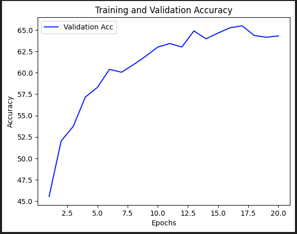
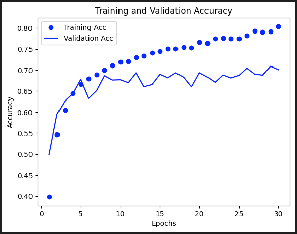
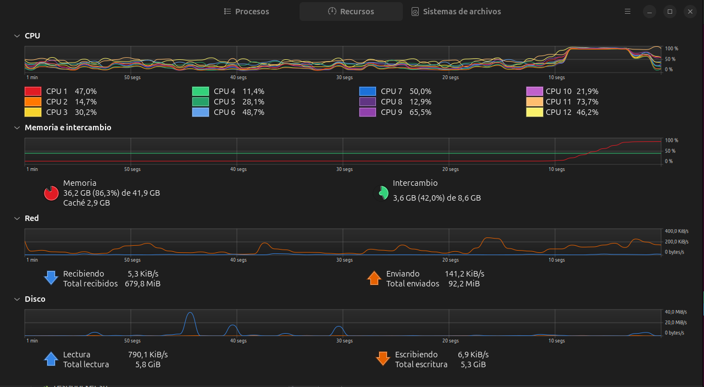
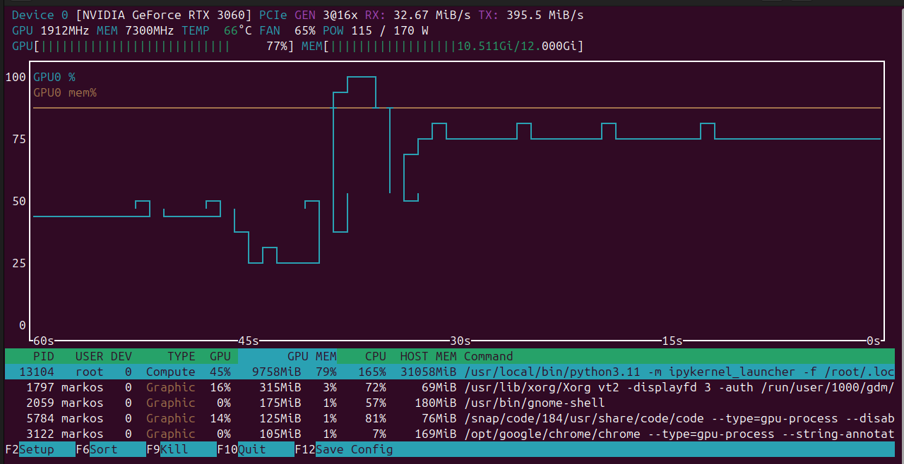

# Actividad AlexNet - Diplomado Inteligencia Artificial y Ciencia de Datos

## Objetivo principal

Desarrollar el modelo AlexNet desde cero tanto en Pytorch como en TF/Keras

## Integrantes del equipo

* Marcos Cortes Valadez
* Cecilia Gomez Castañeda

## Actividades realizadas

### Desarrollando AlexNet desde cero en Pytorch 

* Se analizó el código del modelo LeNet desde cero. Este código fue la base para comenzar con el desarrollo del modelo AlexNet en Pytorch
* Se analizó un diagrama del modelo AlexNet tomado de la [wiki](https://en.wikipedia.org/wiki/AlexNet)
* Para los parámetros de cada capa se revisó el modelo preentrenado que ofrece Pytorch por default, usando torchsummary
* De la misma forma que en el modelo de Lenet usamos CIFAR10 para entrenar el modelo. Estas se tuvieron que redimensionar a 224x224 para que fueran admitidas por el modelo.
* Las características de la máquina usada para realizar el entrenamiento son las siguientes
    * CPU: 12 nucleos
    * Memoria: 40GB
    * Almacenamiento: M.2 1TB
    * GPU: NVIDIA GeForce RTX 3060 12GB
* El modelo se entrenó para 20 epocas demorando 21min 42seg

    * Con un accuracy de 64%

### Desarrollando AlexNet desde cero en TF/Keras

* Tomando como base el modelo desarrollado en Pytorch se usaron las mismas capas y parámetros para crear el modelo en TF/Keras
* También para el entrenamiendo de este modelo se usaron las imágenes de CIFAR10, las cuales tambien se redimensionan a 224x224
* Se realizó el entrenamiendo en la misma máquina para 20 epocas
* Para 20 epocas el entrenamiento demoró casi el mismo tiempo de 20min
* Se realizó un segundo entrenamiendo con 30 épocas tomando un total de 29min

* Con un accuracy de 81%

### Conclusión

* Realizando la comparación del accuracy entre los tres modelos tenemos lo siguiente:
    | Pytorch from scratch      | Keras from scratch    | Pretrained Pytorch    |
    | -----------               | -----------           | -----------           | 
    |                    67%    |                   81% |                   78% |

* Vemos que el accuracy del modelo creado en Keras es mucho más alto que lo que se obtuvo con Pytorch
* Analizaremos nuevamente el modelo y como fue entrenado el modelo para revisar si se cometió algún error
* Observamos que ambas bibliotecas Pytorch y Keras son relativamente fáciles de usar para crear modelos, aunque tienen sus diferencias
* Es importante medir la cantidad de recursos que se tienen en la máquina ya que para el entrenamiento se ocupa todos o la mayoria. Se muestran algunas capturas

